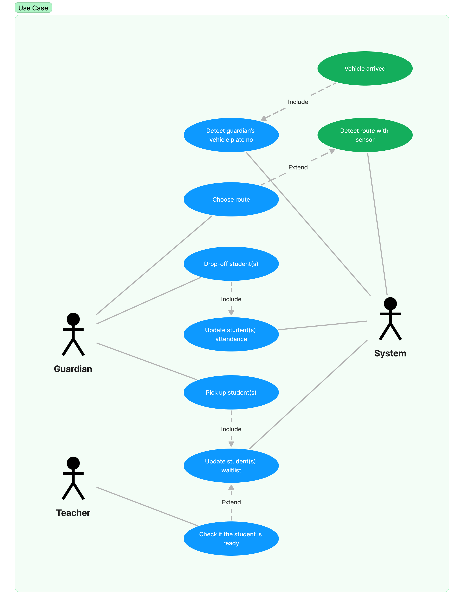

# CSCI 3301: School Run App

<b>School Run App</b> is a MIPS assembly project for CSCI 3301: <i>Computer Architecture & Assembly Language</i> and it was assigned by our instructor, <b>Ts. Dr. Hafizah Binti Mansor.</b>

### Group Members
| No. | Name  | Matric No |
| :-: | :---- | :-------: |
| 1   | Muhammad Hadif Bin Mohd Hatta | 2114589 |
| 2   | Sanoh Ahmad                   | 1921973 |

* Please note that all the works are distributed equally; all commits in this repository don't determine the project distributions since not everyone is familiar with the usage of GitHub.

## Project Diagrams

* All diagrams are designed/redesigned using Figma.
